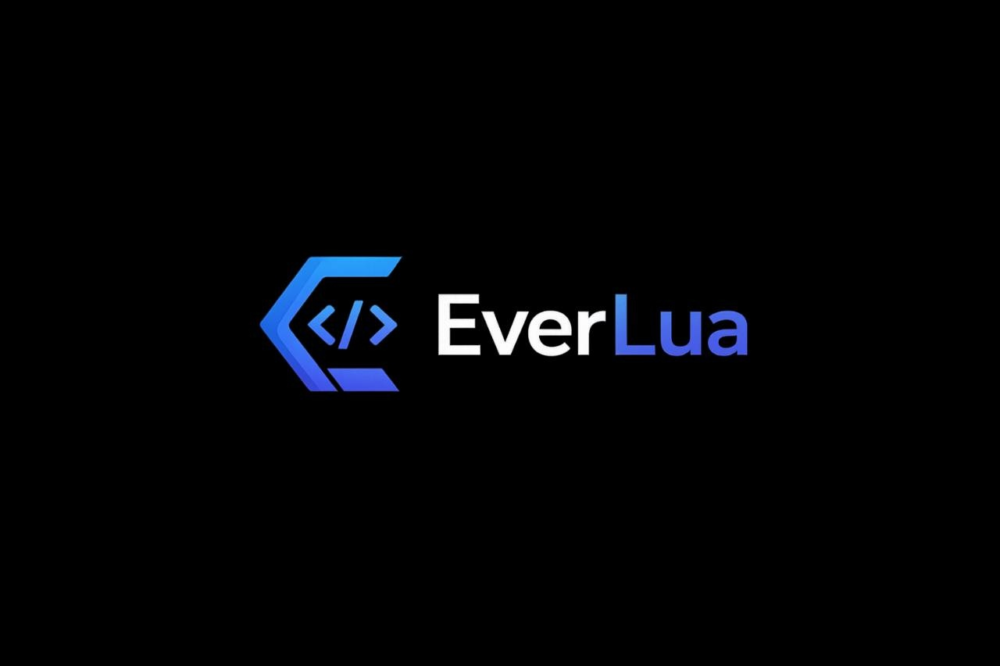

# EverLua Beta - Free AI Agent for Roblox Studio




**EverLua** is a free browser extension that turns ChatGPT, DeepSeek, Gemini, Kimi, GLM, Qwen, Arena or Meta AI into a Roblox Studio AI agent.
Control Roblox Studio with AI directly from your browser - read/edit scripts, run Luau, generate assets, all from a normal AI chat. No API key, no terminal, no coding needed.

Eight AI providers are supported: **ChatGPT** (chatgpt.com), **DeepSeek** (chat.deepseek.com, recommended), **Google Gemini** (gemini.google.com), **Kimi** (kimi.com, Moonshot AI), **GLM** (chat.z.ai, Z.ai), **Qwen** (chat.qwen.ai), **Arena** (arena.ai, a multi-model playground) and **Meta AI** (meta.ai). Gemini and Kimi can be unstable: Gemini tends to stop using the Roblox tools in long sessions, and Kimi sometimes uses its own native tools instead of the Roblox commands. On Arena, use **Direct** mode (EverLua only supports Direct; it blocks Start in Battle / Side-by-Side / Agent modes). DeepSeek is the recommended provider.

> 💬 **Stuck? Join the [Discord community](https://discord.gg/f6QhDBSTZa)** get help, share feedback, and follow updates.

> *Also known as: EverLua Roblox, EverLua free download, Roblox DeepSeek agent, Roblox Gemini agent, Roblox Kimi agent, Roblox GLM agent, Roblox Qwen agent, Roblox Arena agent, Roblox Meta AI agent, Roblox Studio AI automation, Luau AI, MCP Roblox, lemonade alternative free, lemonade.gg alternative, free Roblox AI agent, free lemonade roblox alternative*

## ⚠️ EverLua is Free Beware of Paid Copycats

EverLua is free to download and use. There is no official paid version, no subscription, and no sign-in required to use the extension. EverLua Beta is proprietary software: please download it only from the official release page and do not copy, repackage, or redistribute it.

If you come across a site or extension using the EverLua name that asks for payment or account creation, it is **not** this project. The only official links are the ones listed at the top of this README.

## How it works

```
AI chat (DeepSeek / Gemini / Kimi / GLM / Qwen / Arena / Meta AI, in your browser) -> EverLua Extension -> Bridge (your PC) -> Roblox Studio
```

The extension runs inside the chat page (DeepSeek, Gemini, Kimi, GLM, Qwen, Arena or Meta AI). When you type a request, it sends commands to the Bridge running on your PC, which drives Roblox Studio through the built-in MCP server.

## Setup


### 1. Download the zip and install the extension

Download the latest zip from the **official Releases** page and extract it. The zip contains both the **Bridge** and the **extension folder**.

To load the extension:

- Go to `edge://extensions` (Edge) or `chrome://extensions` (Chrome)
- Enable **Developer mode** (top right toggle)
- Click **Load unpacked**
- Select the `everlua-extension` folder from the extracted zip

### 2. Start Roblox Studio and enable MCP

Open Studio and load a Place, then enable MCP (first time only):

- Click **Assistant AI** in the top bar
- Click **...** (top right of the Assistant panel)
- Click **Manage MCP Servers**
- Click **Enable Studio as MCP Server**


### 3. Run the Bridge

- **Windows:** double-click `start.bat` inside the extracted folder.
- **macOS:** double-click `MacOS_Start.command` inside the extracted folder. The first time, macOS will show a security warning ("could not verify... free of malware") - this is normal for any script downloaded outside the App Store, click **Done**, then go to **System Settings > Privacy & Security**, scroll to the bottom, and click **Open Anyway**. You only need to do this once.

A small window opens, that means the Bridge is running.

### 4. Start a session

Go to https://chatgpt.com, https://chat.deepseek.com (recommended), https://gemini.google.com, https://www.kimi.com, https://chat.z.ai, https://chat.qwen.ai or https://arena.ai and open a new chat. The EverLua bar appears above the input box. Click **Start session**. Type what you want to build.

> Only works on chat.deepseek.com, gemini.google.com, kimi.com, chat.z.ai, chat.qwen.ai and arena.ai - it will not work on any other site.
> On Arena, keep the mode dropdown on **Direct** - EverLua blocks Start in Battle / Side-by-Side / Agent modes (it only drives a single Direct reply).
> Gemini and Kimi can be unstable (model behavior, not the extension): Gemini may stop using the Roblox tools after a while, and Kimi may use its own native tools instead. If the AI starts answering in plain text instead of acting, remind it to use the commands or start a new session.
## What the AI can do

- Read and edit scripts
- Run Luau code directly in Studio
- Inspect the game tree and instances
- Generate meshes, materials, and models
- Browse and insert from the Creator Store
- Control play-testing
- **Remember your project across sessions** persistent project memory saved inside your place

## New in 1.5.0

- **Backgrounding the AI tab no longer strands a command as "not run":** the response watcher now pauses while the tab is hidden and shifts every deadline forward by the time it was paused, instead of burning its inactivity timeout off-screen. The bar shows a **Paused** state while waiting, and resuming is instant (event-driven, not polled).
- **Gemini: fixed the page freezing on a large tool result** (e.g. a big `http_get`) - outgoing text is now capped and the composer insert yields periodically so the page stays responsive and Stop stays clickable.
- **Gemini: fixed the system prompt occasionally never leaving the composer on Start**, caused by the wedged-stop-button detector refusing its own first recovery attempt.
- **Kimi: fixed the model picker looping open/closed** after Kimi's K3 update removed the model it used to default to. The native-agent guard now also correctly detects **K3 Swarm**.
- **Degraded mode (Roblox Studio closed) starts much faster:** the tool catalogue is now cached briefly instead of being re-fetched (and re-timing-out) three times in a row during boot.

## New in 1.4.9

- **Popup: new Settings button** opens the Switch AI / support panel without needing an already-started conversation, and the footer no longer singles out chat.deepseek.com since seven providers are supported.
- **Bridge: auto-recovers its own port on relaunch** instead of crashing with a cryptic error when a previous Bridge was still holding it - and gives a clear, actionable message with the exact commands to fix it when the port is held by something else.
- **Fixed the agent parsing/executing commands while its AI tab was backgrounded or the window minimized** (observed live on GLM), which could run a tool blind or send duplicate feedback. It now pauses - with no time limit - until the AI tab is foreground again, then resumes exactly where it left off.

## New in 1.4.8

- **macOS support:** a new double-clickable `MacOS_Start.command` launcher runs the Bridge on macOS, no Terminal knowledge required.
- **DeepSeek: fixed a possible stuck send** when a tool result was too long for DeepSeek's input box - it's now trimmed to fit automatically.

## New in 1.4.7

- **Qwen: fixed a rare "done but nothing happened" tool call:** with repeated commands a tool chip could show a green check while the command never actually ran and returned no result. The agent now tracks each Qwen turn by a stable id, so it no longer confuses two similar turns.
- **Image support that follows the model you pick:** on Qwen, screenshots and image input are enabled only on its vision-capable models and turned off on text-only ones, updating when you switch models. On DeepSeek, choosing the Vision tab now enables screenshots and image input for it.
- **DeepSeek: fixed image sending:** a captured screenshot used to be attached twice and never sent. It now uploads once and sends correctly.
- **Qwen: fixed the bar covering the "Expand more models" menu.**

See [CHANGELOG.md](CHANGELOG.md) for older releases.

## Panel status

| Dot | Meaning |
|-----|---------|
| Green | Bridge + Studio ready (a place is open) |
| Yellow | Bridge OK, but Studio isn't usable yet - open Roblox Studio, load a place, or enable its MCP server (hover the dot for the exact reason) |
| Grey | Bridge offline - run start.bat (Windows) or MacOS_Start.command (macOS) |

## EverLua modes and Smart UI Kits

Choose a mode from the EverLua panel before starting a new chat:

- **Chat** — answers and brainstorming only; Studio tools cannot run.
- **Manual** — EverLua asks you to approve or skip every tool call.
- **Automatic** — the normal one-tool-at-a-time agent workflow.
- **Plan** — creates a numbered plan first; you enable execution only after reviewing it.

The **UI** button opens Smart UI Kits: **Main Menu, Inventory, Shop, Settings,
Quest Log, Dialogue Box,** and **Health HUD**. Choose one to give EverLua a
clear UI design brief for your next UI-related request. You can also choose a
Roblox visual theme: **Studio UI, Simulator, Anime Battler,** or **Shooting**.
Both choices persist and safely update the current chat when it is ready; they
never create UI by themselves. **No UI kit** and **No Theme** use only the
game's existing style.

## Requirements

- Windows or macOS
- Roblox Studio (MCP support built-in)
- Microsoft Edge or Chrome
- Python 3.9+ (installed automatically on Windows, or install it yourself on macOS - see [python.org/downloads](https://www.python.org/downloads/))

## Support

Need help or want to share feedback? Join the [EverLua Discord](https://discord.gg/f6QhDBSTZa).

---
